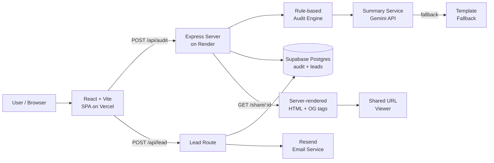

# Architecture

## System diagram

## Data flow: form input → audit result

1. User fills the form in React. Tool entries, team size, and use case are stored in Zustand with `localStorage` persistence.
2. User clicks "Run my free audit." Client POSTs `{ tools, teamSize, useCase }` to `POST /api/audit`.
3. Express validates the payload (array non-empty, teamSize ≥ 1).
4. `runAudit(input)` maps over each tool entry and calls `runToolAudit(entry, teamSize, useCase)`.
5. Each tool rule checks: (a) is the user on the right plan for their team size? (b) is there a cheaper plan from the same vendor? (c) is the tool a fit for their stated use case? Returns a `ToolRecommendation` with `monthlySavings` and `reason`.
6. Total monthly and annual savings are summed.
7. `generateSummary(audit)` calls Gemini API (gemini-3.1-flash-lite) with a structured prompt. Falls back to a hardcoded template if the API key is missing or the call fails.
8. The full `AuditResult` is saved to Supabase `audits` table with a `nanoid` ID.
9. The server responds with the audit JSON. Client navigates to `/results/:id` with the data in `location.state`.
10. If a user navigates directly to `/results/:id` (cold load), the client fetches `GET /api/audit/:id` to hydrate.

## Lead capture flow

1. User clicks "Save report to email." `LeadModal` opens.
2. Modal sends `{ auditId, email, companyName?, role?, website }` to `POST /api/lead`.
3. Server checks `website` honeypot field — non-empty = bot, silently returns 200.
4. Valid lead is saved to Supabase `leads` table.
5. `sendAuditConfirmationEmail` is called non-blocking — fires and forgets, does not delay the response.
6. Resend sends an HTML email with the full per-tool breakdown. High-savings cases include a Credex consultation CTA.

## Share page flow

1. Server renders `/share/:id` as plain HTML — no React, no client-side JS.
2. Response includes `<meta property="og:*">` and `<meta name="twitter:*">` tags with the savings number and tool count.
3. Identifying info (email, company name) is not included in the public share page — only tools, plans, and savings numbers.
4. The page includes a CTA linking back to the main tool to drive new audit starts.

## Stack choice

| Layer | Choice | Reason |
|---|---|---|
| Frontend | React + Vite | Faster dev loop than Next.js for a pure-CSR app. No SSR needed for the form/results pages. |
| Backend | Express (Node.js) | Minimal, well-understood, easy to deploy on Render. The share page and OG meta tags are served from Express — no need for a full SSR framework. |
| Language | TypeScript | Shared types between client and server catch mismatches at compile time, not runtime. Critical for the `AuditInput` / `AuditResult` contract. |
| Storage | Supabase (Postgres) | Started with JSON file, switched on Day 5 when share URLs broke on server restart. Supabase free tier covers this workload and persists across deployments. |
| Email | Resend | Simple REST API, generous free tier (3,000 emails/month), good HTML email rendering. |
| AI summary | Google Gemini API (gemini-3.1-flash-lite) | Fast, free tier (1,500 req/day), no billing required. |
| Abuse protection | Honeypot + express-rate-limit | Honeypot covers bots with zero user friction. Rate limiting (30 req/15 min/IP) covers bulk programmatic abuse. |

## What I'd change for 10k audits/day

1. **Move from Supabase free tier to a dedicated Postgres instance on Render with PgBouncer connection pooling.** Supabase free tier has connection limits (100 simultaneous) that become a bottleneck at high load. Postgres gives proper concurrency, indexing, and queryability for analytics.
2. **Move rate limiting to the edge (Cloudflare or an API gateway).** Per-process rate limiting doesn't work correctly behind a load balancer with multiple instances.
3. **Cache the Gemini API call results.** At 10k audits/day, the summary generation is a significant cost. Cache by a hash of `(tools, teamSize, useCase)` with a 24-hour TTL.
4. **Separate the share page to a CDN-cached route.** Share pages are read-heavy and static per audit. Serve them from a CDN with a `Cache-Control: public, max-age=3600` header.
5. **Add a job queue (BullMQ or similar) for email sending.** Resend API calls should not block request handlers even in fire-and-forget mode — a queue with retry logic is more reliable.