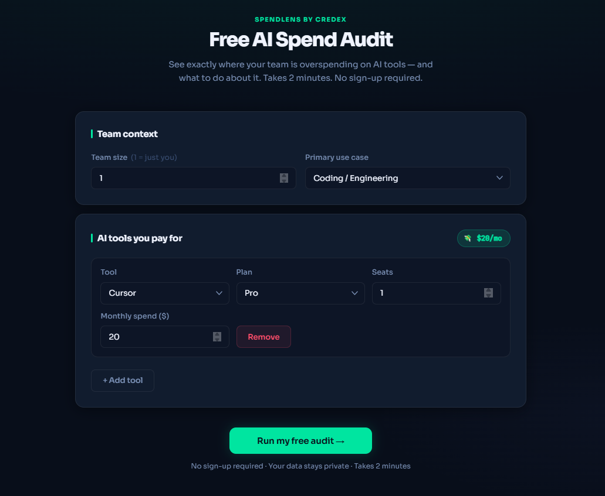
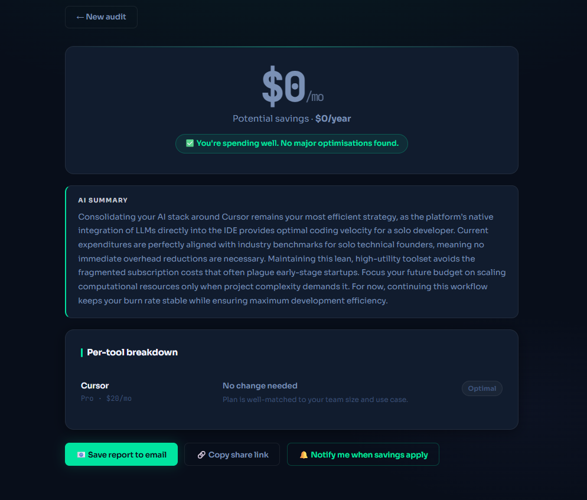
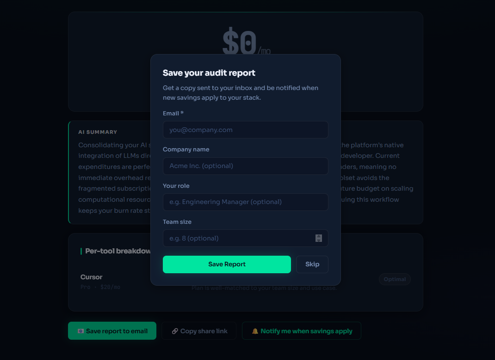

# SpendLens — Free AI Spend Audit

SpendLens is a free web app that audits a startup's AI tool spending across Cursor, GitHub Copilot, Claude, ChatGPT, Gemini, and others — surfacing overspend, plan mismatches, and savings opportunities in under 2 minutes. It's a lead-generation asset for [Credex](https://credex.rocks), which sells discounted AI infrastructure credits.

**Who it's for:** Engineering managers and founders at 2–30 person startups paying for multiple AI tools without knowing if they're getting value.

---

## Screenshots

> **Form page** — Enter your AI tools, plans, seats, and monthly spend. Form state persists across reloads.



> **Results page (optimal spend)** — "You're spending well" state with AI summary and per-tool breakdown. Still captures the lead with notify-me signup.



> **Lead capture modal** — Email gate shown after value is delivered. Optional company name, role, and team size fields.



---

## Quick start

```bash
# 1. Clone and install
git clone <your-repo-url>
cd credex-ai-spend-audit-basic
npm install

# 2. Configure environment
cp .env.example .env
# Fill in GEMINI_API_KEY (optional — app works without it via fallback summary)
# Fill in RESEND_API_KEY (optional — email confirmation skipped if not set)
# Set PUBLIC_SITE_URL to your deployed URL for correct share links

# 3. Run locally
npm run dev
# Client: http://localhost:5173
# Server: http://localhost:4000
```

## Run tests

```bash
npm run test
# or
cd server && npm test
```

## Deploy

**Frontend:** Vercel — connect the repo, set root to `/client`, build command `npm run build`, output `dist`.

**Backend:** Render — set root to `/server`, build command `npm install && npm run build`, start command `node dist/index.js`.

Set these environment variables in both platforms:
- `GEMINI_API_KEY` — for AI-generated summaries
- `RESEND_API_KEY` — for transactional confirmation emails
- `PUBLIC_SITE_URL` — your deployed backend URL (used for share links and OG tags)
- `CLIENT_URL` — your deployed frontend URL (used for CORS)

---

## Live URL

`https://spend-lens-client.vercel.app`

---

## Decisions

1. **React + Vite over Next.js** — No SSR needed for the audit flow. Vite gives faster local dev and simpler Vercel deploys. The share page is server-rendered HTML from Express, which is all the OG-tag SSR we need. Next.js would add complexity without benefit here.

2. **Supabase for storage** — Started with JSON file storage for zero-dependency MVP, but switched to Supabase on Day 5 when the share URL broke on server restart (Render free tier wipes memory/temp). The `storage.ts` module has a clean interface (`saveAudit`, `getAudit`, `saveLead`) that made the swap a 30-minute change. Supabase free tier covers this workload; data persists across server restarts.

3. **Rule-based audit engine, not AI** — The assignment explicitly tests whether candidates know when *not* to use AI. Hardcoded logic with cited pricing is auditable, deterministic, and fast. A finance person can read the rules and agree or disagree. AI hallucinating pricing numbers would be worse than no recommendation at all.

4. **Zustand + localStorage for form persistence** — Simpler than Redux, and the `persist` middleware gives form-reload survival for free with one line of code. A user who starts filling in their tools, closes the tab, and returns will find their data intact.

5. **Honeypot + rate limiting for abuse protection** — hCaptcha adds friction for real users and requires a third-party script. A hidden `website` field silently rejects bots at zero UX cost. Rate limiting (30 req/15 min per IP) covers bulk abuse. For a lead-gen tool at this stage, this is the right trade-off between security and conversion rate.